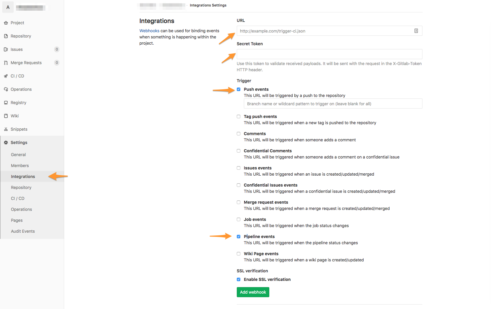

# Getting Started

## Quick Start Guide

### 1. Create a Gitlab Pipes Account

We do not currently support Gitlab OAuth \(I know right\), but we will in the near future, for now new accounts can be created through our [Login Page](https://gitlabpipes.com/ap/login).

### 2. Create a Gitlab Pipes Organization

Projects are grouped under Organizations. Create an Organization for your group of projects.

### 3. Add `.gitlab-pipes.yml` Configuration

Create a `.gitlab-pipes.yml` file in the root of each project that you want to have Gitlab Pipes orchestrate builds for you.



```yaml
only:
  - master

dependencies:
  - BackendDatabaseModels/master
  - ExternalClientModels/master
  - CommonsProject/maybe-another-release-branch
```



More information about the syntax of this file can be found [here](configuration/.gitlab-pipes.yml.md).

### 4. Register Gitlab Webhooks to Gitlab Pipes

Gitlab Pipes listens to Push Events and Pipeline Events from Gitlab to let it know when to act. You must register Gitlab Pipes to receive the proper webhooks from Gitlab.


**If you are paying for Gitlab Silver or Higher Tier then you can configure Webhooks at the Group level.**




> **Webhook URL:** **https://hooks.gitlabpipes.com/v1/webhooks/gitlab**
>
> **Secret Token: Get from GitlabPipes.com. Go to your Organization and click Tokens.**
>
> **Trigger: Push Events, Pipeline Events**


Make sure you add your Gitlab Event to the Secret Token box.


Click **Add Webhook!**

### 5. Make sure `.gitlab-ci.yml`  is set to API only

Modify your `.gitlab-ci.yml` jobs to only be triggered via API. You can also add `web` to allow you to manually start pipelines in the case of an emergency.

Add `api` and `web` under an `only` block in each job that will need to run when a commit is pushed to a release branch or when a downstream dependency changes.



```yaml
stages:
  - snapshot

snapshot:
  image: registry.gitlab.com/docker/mavenartifactorydocker
  stage: snapshot
  only:
    - api
    - web
  script:
    - echo "This job will be triggered only by Gitlab Pipes or manually"
```



### 6. Commit Code into Your Gitlab Project

The last step is to commit code into your Gitlab Project to make sure it all works.

Commit code into your Project Repository and go to GitlabPipes.com and open your Organization's Pipelines and you should see a **Pending Build**.

